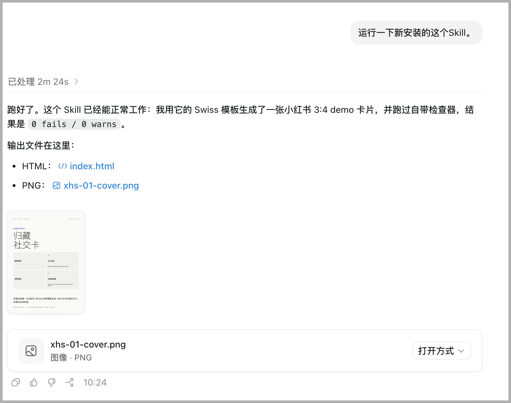
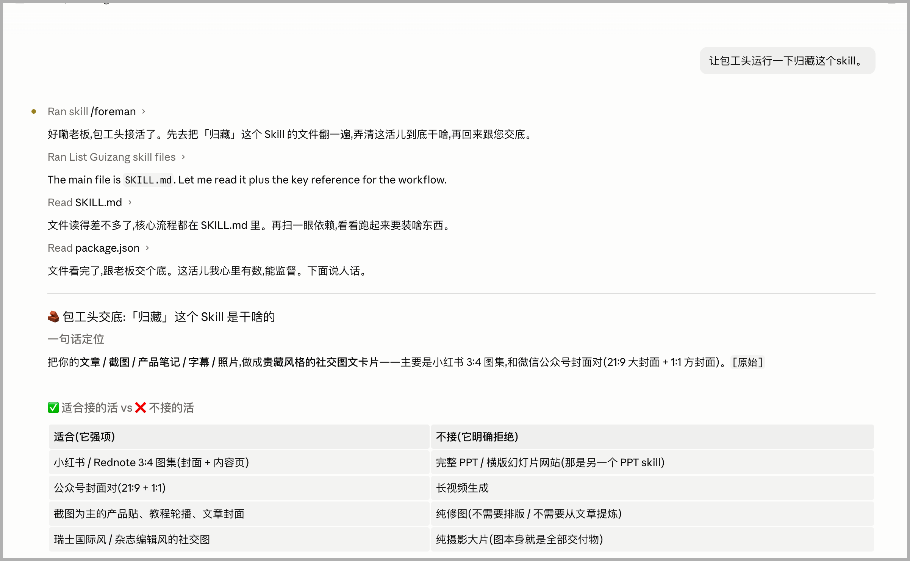
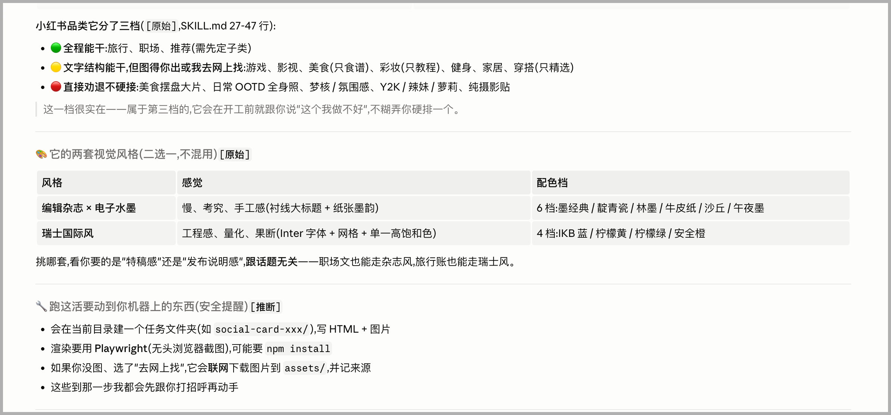
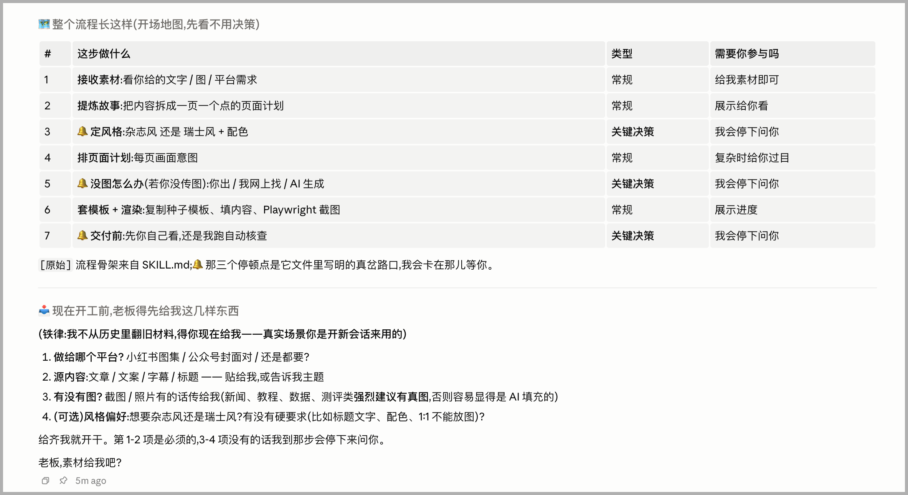

# 包工头(Foreman)

> 一个**作用于其它 Skill 的 Skill**:运行任何一个 Skill 时,把它从"黑盒"翻译成"看得懂、可监督、能随时插手"的过程。

就像有人写了个"安全审查 Skill"专门审查别的 Skill 有没有风险——「包工头」也是一个作用于 Skill 的 Skill,只不过它管的是"看懂 + 上手 + 监督 + 调整"。

## 为什么做这个

现在大多数 Skill 跑起来都是**黑盒**:你发一句指令,它闷头跑一阵,直接甩给你一个结果。中间它在干什么、读了哪些文件、按什么逻辑走、哪几步其实你本可以做主——你统统看不到,也插不上手。

这带来两个问题:

- **不可控**:结果不对,你不知道是哪一步偏了,只能整个推翻重跑。
- **限制了 Skill 的通用性**:一个 Skill 内部其实有不少可调的地方(风格、口吻、深度、要不要某一步……),但你看不见、改不动,它就只能按作者预设的唯一一条路跑,适配不了你的具体场景。

「包工头」就是来解决这个的:**让"运行一个 Skill"从"交出去等结果",变成"看得见、插得上手"。**

## 长这样:没有它 vs 用了它

**❌ 直接运行一个 Skill(黑盒):** 它闷头跑两分钟,直接把结果甩给你——你不知道它干了啥、也没机会插手。



**✅ 让包工头运行同一个 Skill:** 它先用大白话跟你**交底**——这 Skill 是干嘛的、能接什么活 / 不接什么:



接着把能力档位、可选风格、还有"会动你机器上什么"的**安全风险**都摊开说清楚:



再把**整个流程拆给你看**、标出哪几步要你拍板,然后**问你要素材**才开干:



> （截图较宽,点击可放大看清。）

## 它和"直接运行"到底差在哪

直接运行 = 黑盒跑完给你结果。用「包工头」运行,它会多做这几件事:

**1. 先把这个 Skill 的所有文件读全**,再用大白话把你该关心的讲清楚:

- 它到底干嘛、适合 / 不适合什么
- 它**能做哪些事**(尽量列全,并标明是"完整枚举"还是"部分,完整见某文件")
- 要跑它,你得给什么输入
- 它可能有哪些**安全风险**(读写本地文件、跑脚本、联网……)
- 凡是推断出来的内容都会**标注**,绝不把"猜的"当成作者明确写的

**2. 把它内部流程拆开给你看**,并分成两类:

- **普通步骤**:默认做、不打扰你,但全程展示(你看得见它在干嘛),你随时能打断、跳过
- **关键决策**:那些"选了结果会明显不同、你大概率有主意"的地方(配什么图?什么风格?)——**它会停下来问你**

**3. 整个过程清晰可见**:一张流程地图实时显示走到哪了(✅ 做完 / 🟡 现在 / ⬜ 待做),多轮对话也不会跟丢。

**4. 关键处你随时能拍板**:每个关键决策都给你几个方向 + 一个推荐 + 推荐理由——没想法的直接跟推荐,有想法的自己挑;想全程放手,说一句"你定"它就跑到底(但仍会把每个决策展示给你,只是不再停下来等)。

> 一句话:**它替你跑,但你全程看得见、随时插得上手、结果不对能一眼看出是卡在哪一步。**

## 怎么安装

把整个 `foreman/` 文件夹放进 `~/.claude/skills/`(和你装别的 Skill 一样):

```
git clone https://github.com/AIisNothing/foreman.git ~/.claude/skills/foreman
```

**更新到最新版**(以后修了 bug,拉一下就有):

```
cd ~/.claude/skills/foreman && git pull
```

## 怎么用

一句话就行:

```
让包工头运行一下 guizang
```

它会**一条流程走到底**:先**解释**这个 Skill 是干嘛、怎么用 → **问你要输入** → **边跑边带你**,到关键决策停下来让你拍板。你随时能停、能改、能跳。

(只想先看懂、不想真跑?它解释完,你说一声停就行——不用记两个命令。)

## 它不做什么

不是 Skill 市场(找)、不是安装管理器(装)、不是给开发者看日志的工具(调试)。它只管一件事:**让你看懂、上手、监督、调整一个 Skill。**

## 已知限制(目前是纯 Skill 实现)

「包工头」现在是一个**纯 Skill**——靠模型在运行时**自觉遵守一套规则**来做监督。这条路零门槛、装上就能用,但也因此有几个暂时绕不开的问题,先跟你说清楚:

- **长对话 / 多任务时,监督可能"松掉"**:对话拉长、或做完一个任务接着做下一个,它有时会"忘了停",把本该问你的关键决策自己做了。根因是规则靠模型记忆维持,长上下文里会衰减。
- **关键决策处只能"停下等你",做不到"倒计时后自动走"**:我们在每个关键决策停下来让你选,本意是**让你参与进来、有掌控感,不是逼你非做选择不可**。理想的样子应该是:停一下、给个倒计时,你不理就自动按推荐项继续——既给你参与的机会,又不耽误事。但纯聊天 / Skill 里**没有计时器**,做不到"自动继续";所以现在你不回话,它只能一直停着等(想放手,得你明说一句"你定")。
- **流程进度只能"每轮重贴",做不到固定的工作台**:理想的样子是整个界面分两块——上半部分是这个 Skill 的介绍,下半部分是一个**全程都在、固定可见的工作区**,里面那条流程步骤始终亮着"现在走到第几步"。但靠 Skill 的对话来实现,我们只能在**每一轮回复里把流程图重画一遍**来模拟它,而不是一个真正钉在那儿的进度条。

这些问题的根子有两类:一是**靠"自律"守纪律,长程里不牢靠**(第 1 条);二是**纯聊天没有真正的界面能力**——没有计时器、没有固定工作台(第 2、3 条)。两者都指向同一个出路:把它做成**带界面 / runtime 的版本**(任务边界用机制强制重置监督 + 真正可视化的工作台)。这个纯 Skill 版的目的,就是先验证"需求到底成不成立",再决定要不要做那一步。

> **遇到上面任何一种,欢迎开 issue 告诉我们**——这恰恰是判断"该不该做下一步"的关键反馈。

## 一句话设计理念

掌控感来自盯住少数几个**关键决策**,而不是盯每一个步骤。步骤会随 AI 越来越自主而爆炸,但真正会让结果跑偏的关键决策永远就三五个——所以我们不做"全功能监督台",只在关键处停下来问你。

## 目录

```
foreman/
├── SKILL.md            # 核心:包工头的行为规范
├── README.md           # 本文件
├── LICENSE             # MIT
├── templates/          # 输出模板
│   ├── skill-card.md       # 解释:产品卡片
│   ├── run-flow.md         # 监督运行:流程地图框架
│   ├── fork.md             # 关键决策提问格式
│   └── trial-summary.md    # 试用总结
├── examples/           # 走查示例
│   ├── guizang-demo.md     # 出图类 Skill
│   └── weread-demo.md      # 非渲染类(含"跳过+代价"、隐私确认)
└── docs/               # README 配图
```
